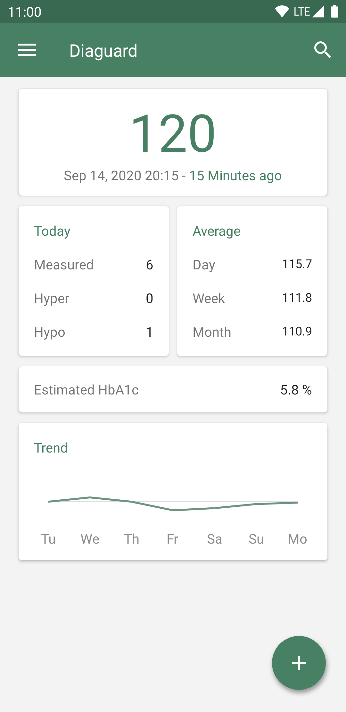
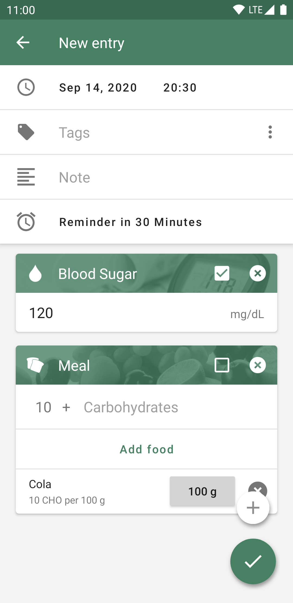
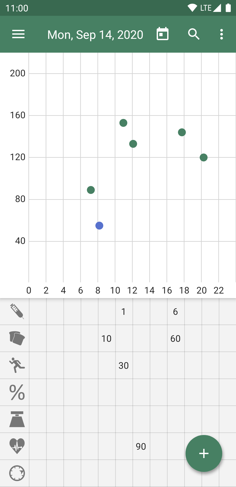
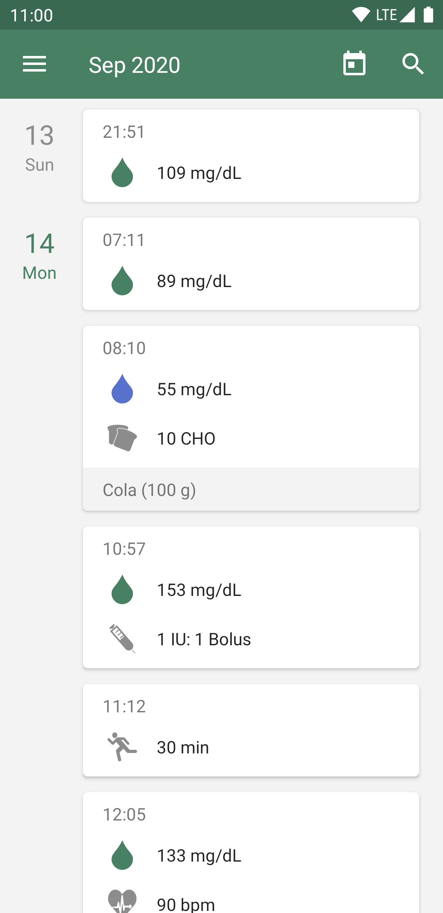
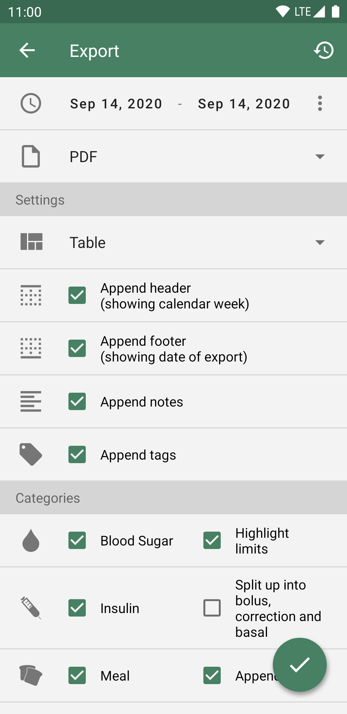
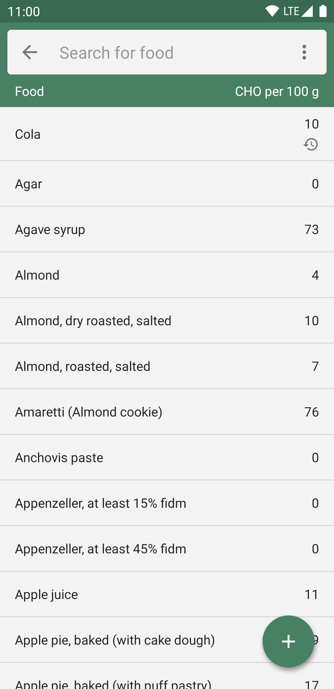
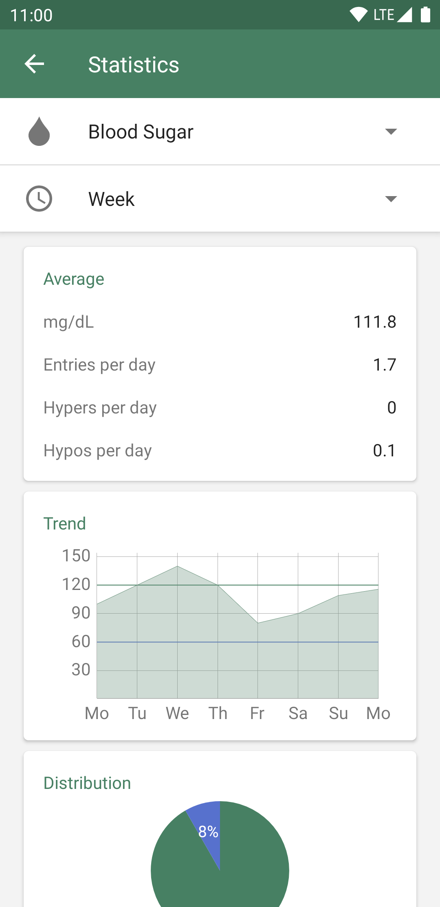

# SugerScope

SugerScope is an Android app designed to help people with diabetes manage their condition more easily. Inspired by the need for accessible and practical health tools, it allows users to log and visualize blood glucose and other health data, generate reports, and stay on top of their diabetes care.

> 

## Features

- Log your blood glucose, insulin, carbs, HbA1c, activity, weight, pulse, blood pressure, and oxygen saturation
- Customizable units
- Visualize blood glucose trends in graphs
- Export data as PDF or CSV
- Backup and restore your data
- Get reminders for health tracking
- Estimate HbA1c automatically
- Access food data with nutritional info
- Statistics for better insight
- Predictions of your glucose level
- Dark Mode

## Screenshots

 
 
  
 
 
 
 

## Getting Started

Clone the repo and open the project in Android Studio. The app is written in Java and uses SQLite with ORMLite for data storage, and XML for layout definitions.

## Development

- **Language:** Java
- **Database:** SQLite + ORMLite
- **UI:** XML + View Binding
- **Architecture:** Model-View-Controller (MVC), with gradual transition to MVVM
- **Testing:** JUnit and Espresso for unit and instrumentation testing
- **Localization:** Android resources for UI; CSV files for food and tags
-**ML**:Sklearn(Python)

## License

This project is licensed under the [GNU General Public License v3.0](https://www.gnu.org/licenses/gpl-3.0.html).

---

> SugerScope is built to help and support—not to replace medical guidance. Always consult a healthcare professional for medical decisions.
